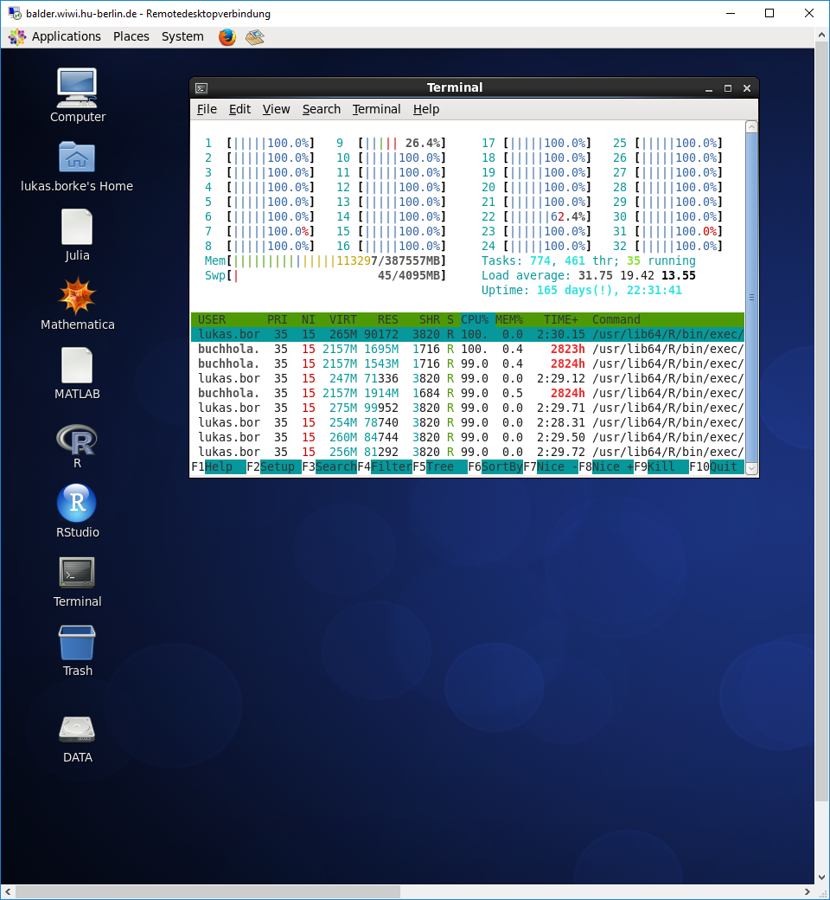

# Clustering_Validation_Pipeline
GitHub-API-Driven Clustering with 5-level Text Mining Validation Pipeline: R based Approach

## I. Cluster validation
1. [clusterCrit: Good plots](plots_good.md)
2. [clusterCrit: Bad plots](plots_bad.md)
3. [clValid: All plots](plots_clValid.md)
4. [clusterCrit: YAML-500](plots_YAML_500.md)
5. [NbClust: YAML-500 (2-20 clusters)](plots_nb_YAML_500_(2-20).md)
6. [NbClust: YAML-500 (2-250 clusters)](plots_nb_YAML_500_(2-250).md)

## II. LSA visualization (with related MDS and PCA plots)
1. [LSA_Visu](plots_LSA_Visu.md)

## Screenshot from the RDC Linux Server showing the parallelization process of cluster validation on 32 CPU's :

