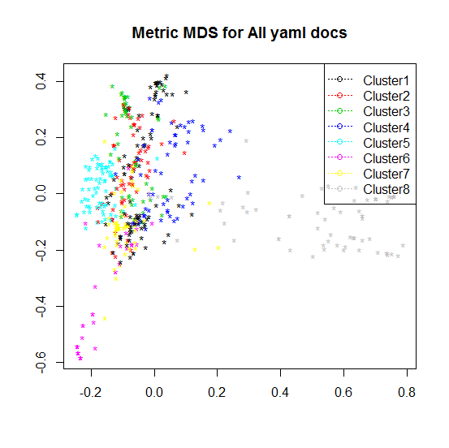

[](http://quantlet.de/index.php?p=info)

## [](http://quantlet.de/) **YAMLcentroids** [](http://quantlet.de/d3/ia)

```yaml

Name of QuantLet : YAMLcentroids

Published in : 'GitHub-API-Driven Clustering with 5-level Text Mining Validation Pipeline: R based
Approach'

Description : 'Plots MDS representation of k-medoids clustering with cluster labeling via the most
frequent terms of cluster centroids for the LSA model of YAML text corpus and gives some cluster
info.'

Keywords : 'plot, graphical representation, data visualization, text mining, svd, MDS,
cluster-analysis, clustering'

See also : lsa_heatmapsvd, lsa_heatmaperr, lsa_determineSign

Author : Lukas Borke, Anastasia Stepanchenko

Submitted : 04.07.2016 by Lukas Borke

Datafiles : YAML_lsa.RData

```




### R Code:
```r
# Clear all variables
rm(list = ls(all = TRUE))
graphics.off()

# Install and load packages
libraries = c("cluster")
lapply(libraries, function(x) if (!(x %in% installed.packages())) {
  install.packages(x)
})
lapply(libraries, library, quietly = TRUE, character.only = TRUE)

# Load data
(obj.names  = load("YAML_lsa.RData", .GlobalEnv))

A       = t(space_matr_auto[[2]])
d       = dist(A)
mdsAll  = cmdscale(d, k=2)

# Medoid-clustering
k       = 8
clus    = pam(d, k, diss = TRUE)

# Plot

plot(mdsAll, type = "n", xlab = "", ylab = "", main = "Metric MDS for All yaml docs")
text(mdsAll[,1], mdsAll[,2], "*", cex = 1, col = clus$cluster)
legend("topright", col = 1:max(clus$cluster), pch=1, legend = paste("Cluster", 1:max(clus$cluster), sep = ""), lty = 3)

# Cluster centroids: possible interpretation of the cluster topic
n = 5
for (i in 1:k) {
                cat(paste("cluster", i, ": ", sep = ""))
                s = sort(A[clus$medoids[i],], decreasing = T)
                cat(names(s)[1:n], "\n")
}

clus$clusinfo

```
