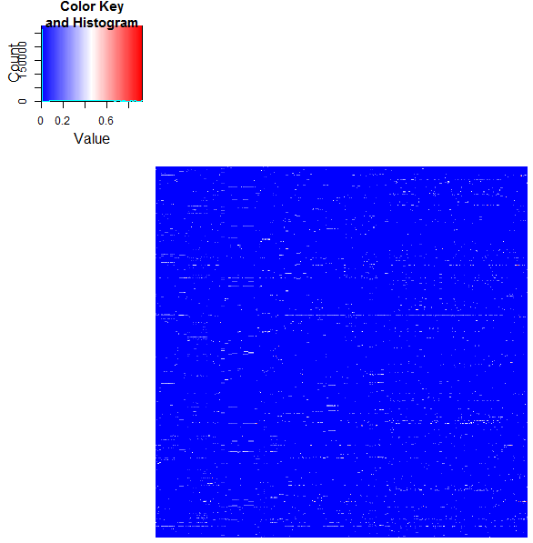
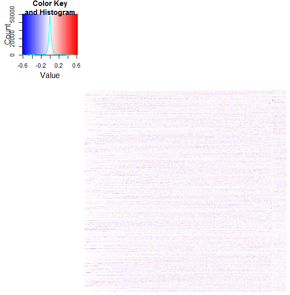
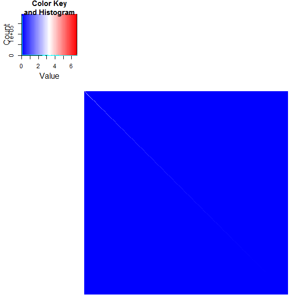
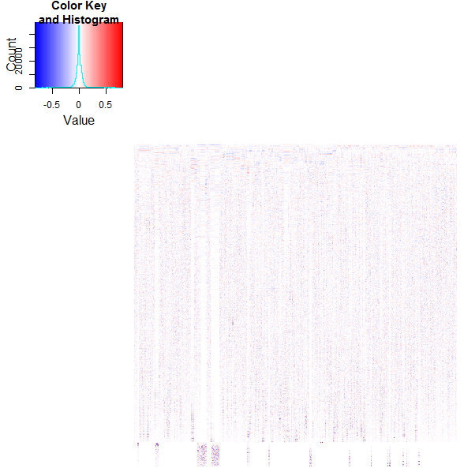
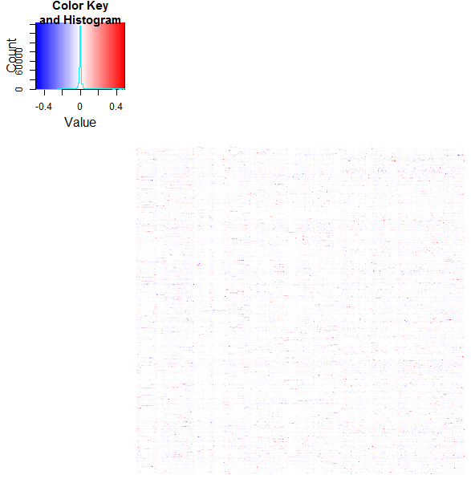

## Calculate here LSA from space = space_full to get the full dimension and full SVD
### Then we have on the left side m_a which satisfies the equation:<br/>
```R
m_a =  U * d_s * t(V)
```







### corresponding R code fragment
```R

space_full = lsa(m_a, dims=min(dim(m_a)))
space = space_full
.
.
.

heatmap.2(m_a, trace="none", revC = FALSE, dendrogram = "none", labRow = FALSE, labCol = FALSE, Rowv = FALSE, Colv = FALSE, breaks =100,col = bluered)
dev.new()
heatmap.2(U, trace="none", revC = FALSE, dendrogram = "none", labRow = FALSE, labCol = FALSE, Rowv = FALSE, Colv = FALSE, breaks =100, col = bluered)
dev.new()
heatmap.2(d_s, trace="none", revC = FALSE, dendrogram = "none", labRow = FALSE, labCol = FALSE, Rowv = FALSE, Colv = FALSE, breaks =100,col = bluered)
dev.new()
heatmap.2(t(V), trace="none", revC = FALSE, dendrogram = "none", labRow = FALSE, labCol = FALSE, Rowv = FALSE, Colv = FALSE, breaks =100,col = bluered)

```

<br/><br/>


## Calculate here LSA from space = space_auto to get the truncated SVD
### Calculation of truncated TDM from SVD (currently 76 dimensions, will vary depending on the current yaml data)
### Then we have on the left side m_a which satisfies the equation:<br/>
```R
m_a = m_lsa + error_matrix
```





### corresponding R code fragment
```R

space_auto = lsa(m_a)
space = space_auto
.
.
.

heatmap.2(m_a, trace="none", revC = FALSE, dendrogram = "none", labRow = FALSE, labCol = FALSE, Rowv = FALSE, Colv = FALSE, breaks =100,col = bluered)
dev.new()
heatmap.2(m_lsa, trace="none", revC = FALSE, dendrogram = "none", labRow = FALSE, labCol = FALSE, Rowv = FALSE, Colv = FALSE, breaks =100,col = bluered)
dev.new()
heatmap.2(error_matrix, trace="none", revC = FALSE, dendrogram = "none", labRow = FALSE, labCol = FALSE, Rowv = FALSE, Colv = FALSE, breaks =100,col = bluered)

```

