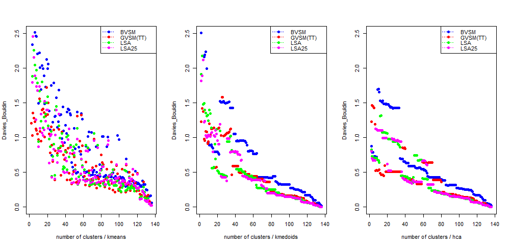
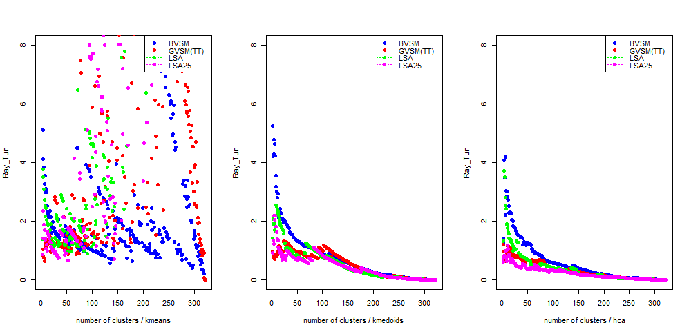
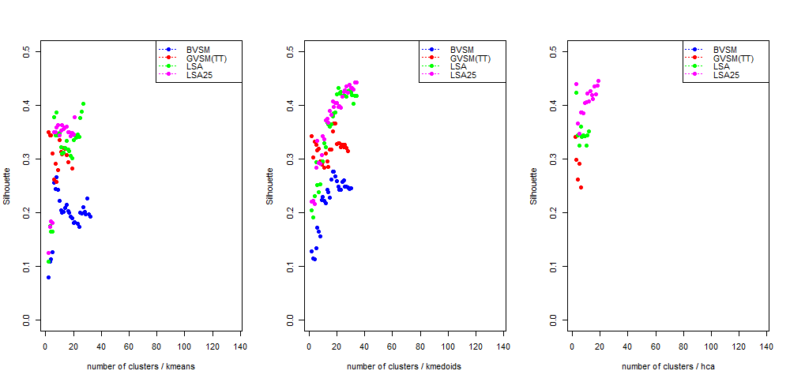
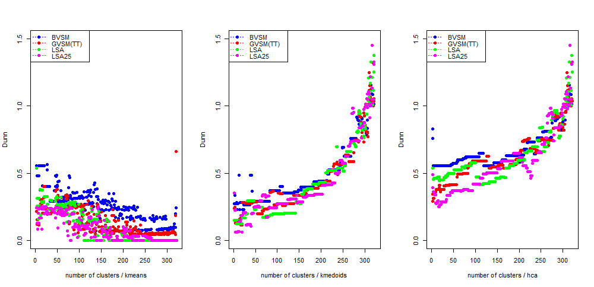

# Comparison of old and new (YAML) sample sets - Uncertain results.

## Davies-Bouldin - to minimize

## Ray_Turi - to minimize

## Xie_Beni - to minimize

# Can be created by another Package, see further plots
## Silhouette - to maximize

## Dunn - to maximize

