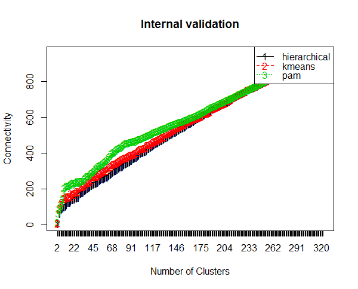
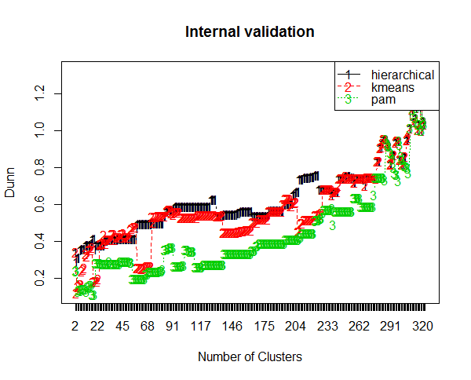
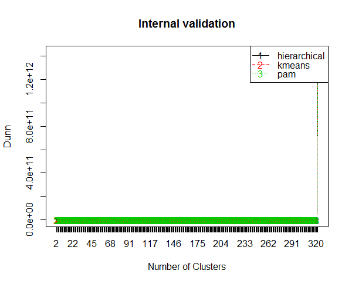
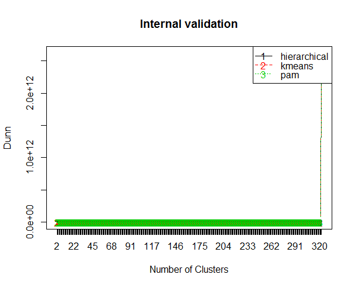
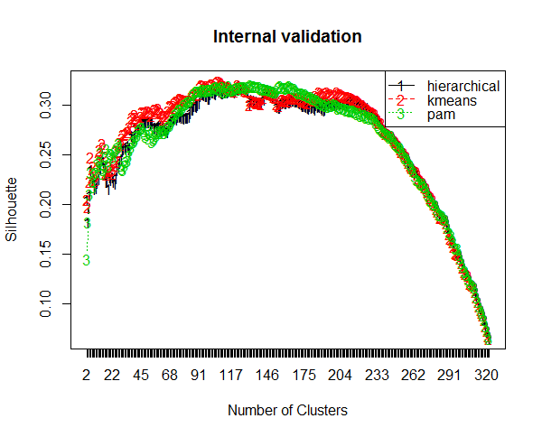
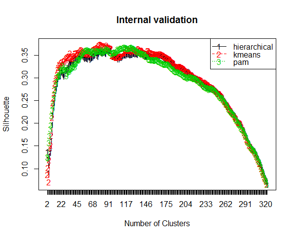

## Connectivity - to minimize
### Models from left to right, top to down: BVSM, GVSM, LSA25, LSA

 

## Dunn - to maximize
### Models from left to right, top to down: BVSM, GVSM, LSA25, LSA

 

## Silhouette - to maximize
### Models from left to right, top to down: BVSM, GVSM, LSA25, LSA

 

