# Comparison of old and new (YAML) sample sets - Useful results.

## Ball_Hall - to maximize difference

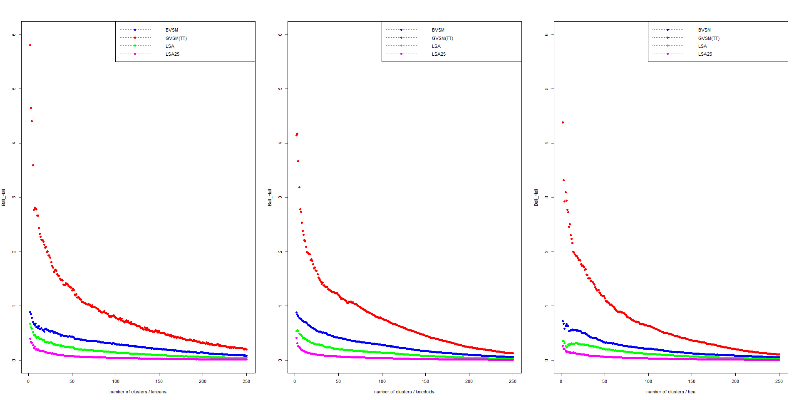

## C_Index - to minimize

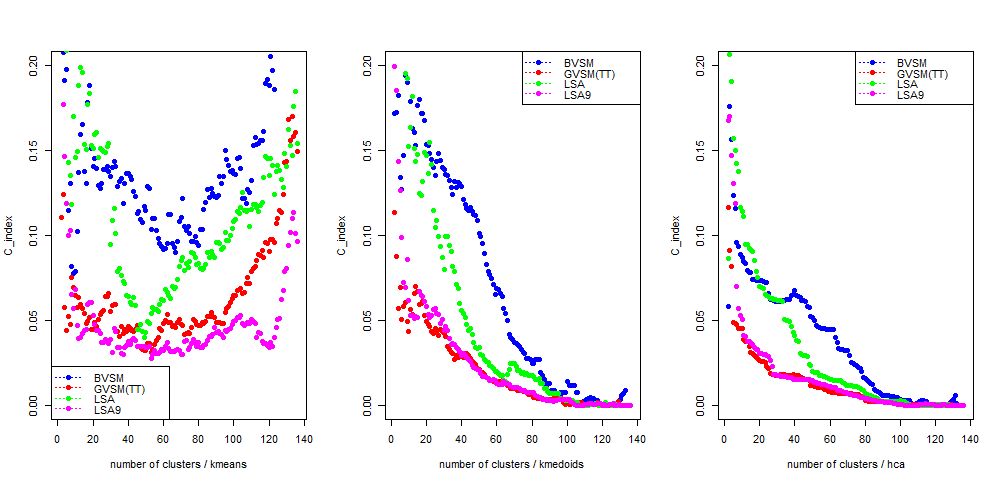
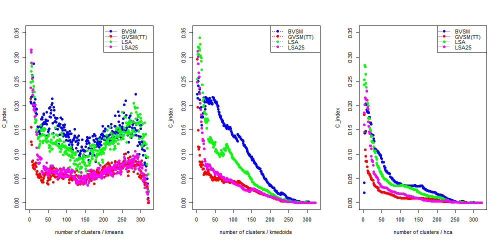
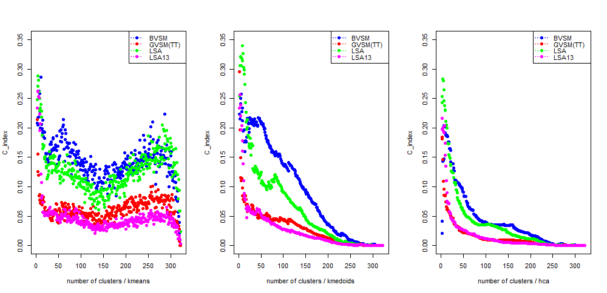
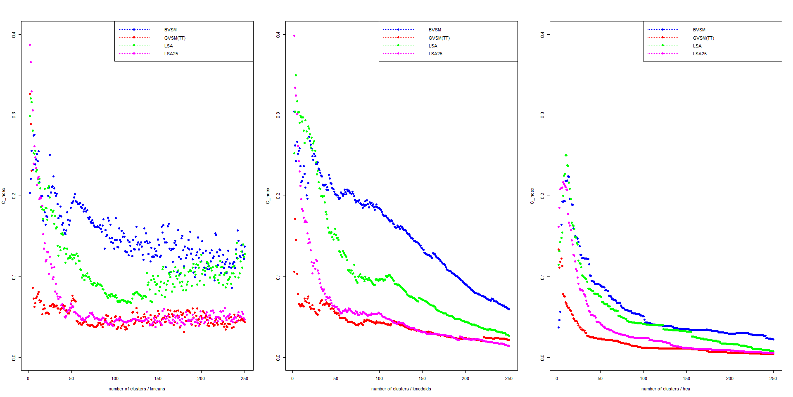

## Calinski-Harabasz - to maximize

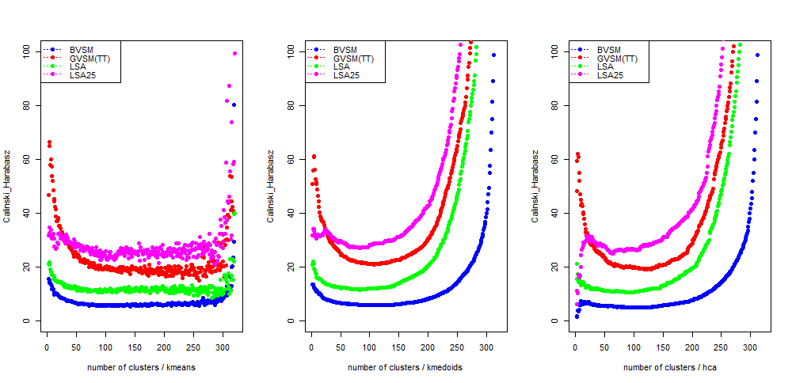
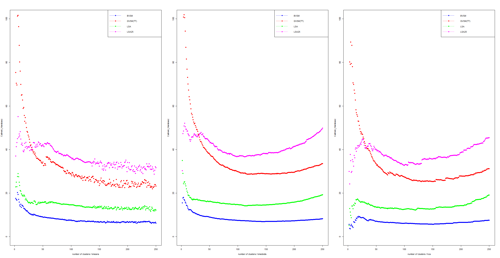

## McClain_Rao - to minimize
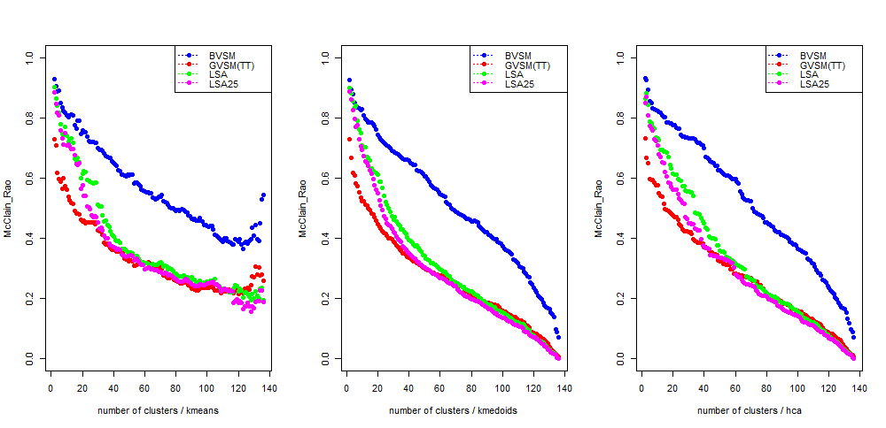

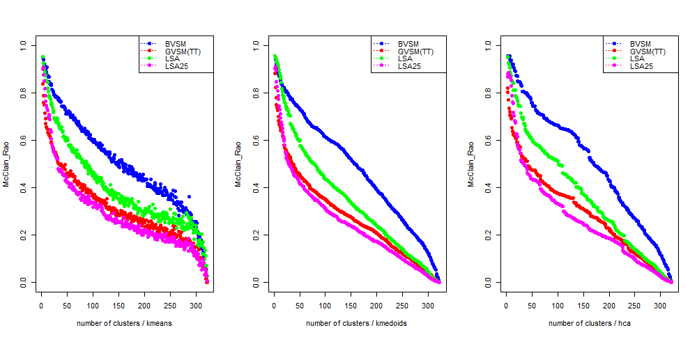
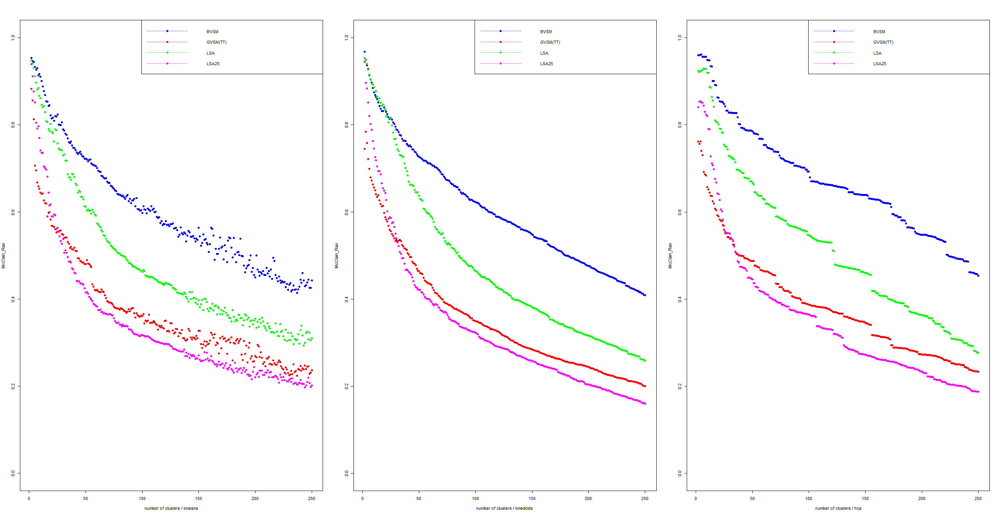

## Ratkowsky_Lance - to maximize

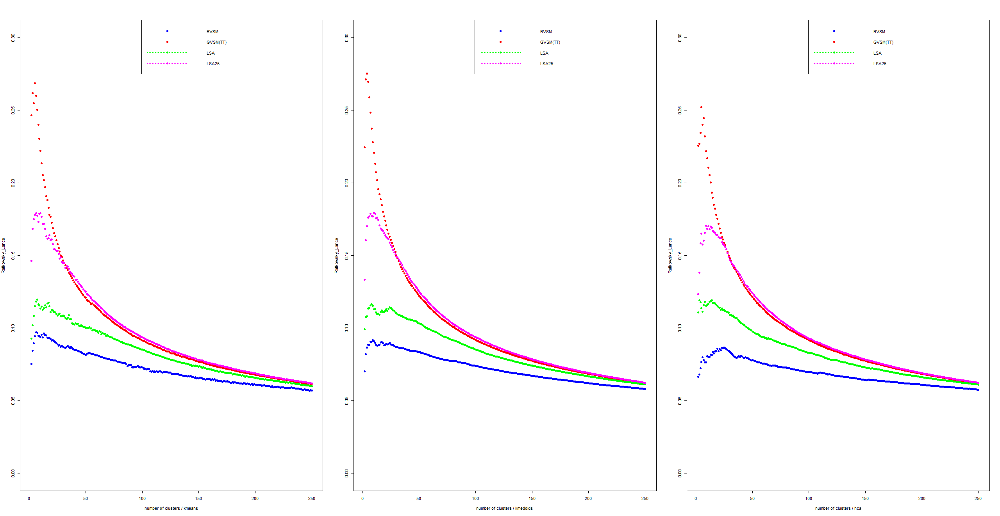

## Trace_W - to maximize difference

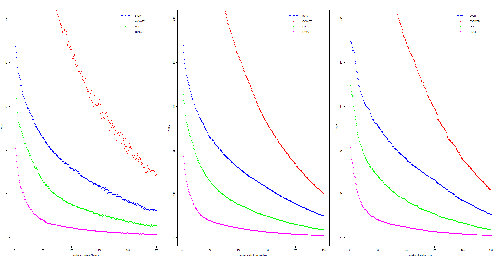

## Wemmert_Gancarski - to maximize 

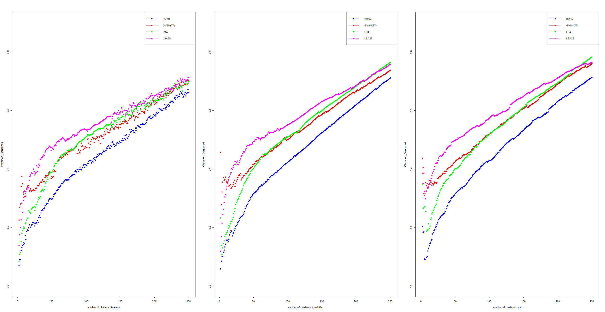
