# NbClust for YAML-500 (2-20 clusters)

## Ball_Hall

* The mean, through all the clusters, of their mean dispersion.
* The range is [0,+∞).
* The difference between two successive slopes to be maximized.

## C_Index
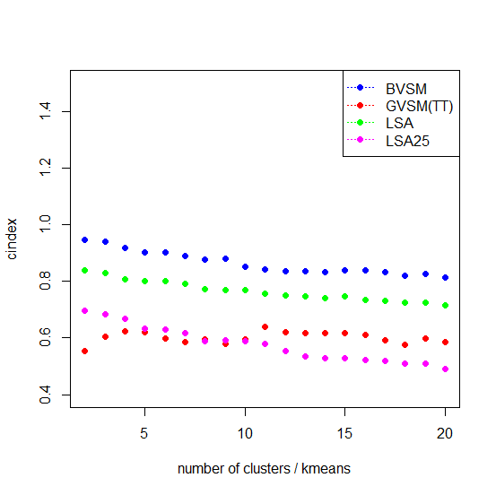
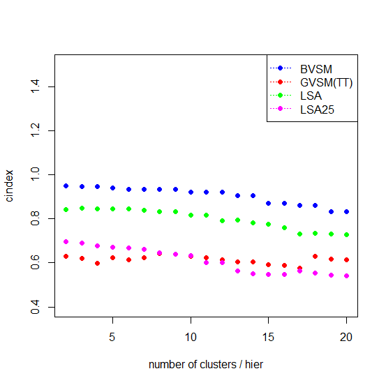

* Shows for a given clustering its fraction of maximal possible increase over minimal distances which within-cluster distances between pairs of points have.
* The range is [0,1].
* To be minimized.

## Calinski-Harabasz
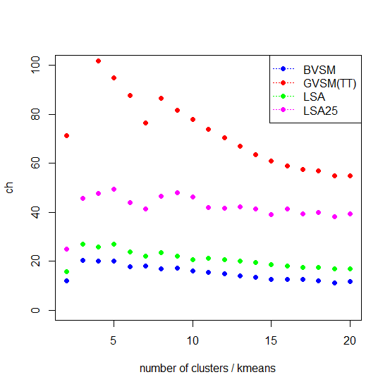
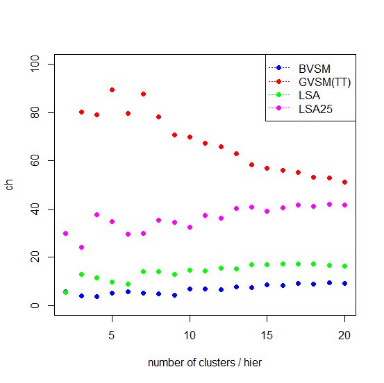

* Is proportional to the quotient of the between-group dispersion and pooled within-cluster dispersion.
* The range is [0,+∞).
* To be maximized.

## McClain_Rao
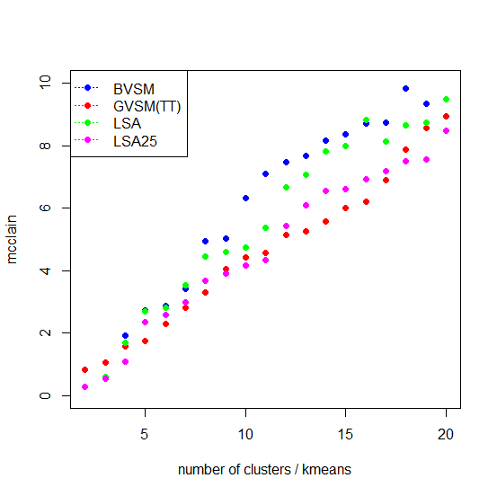
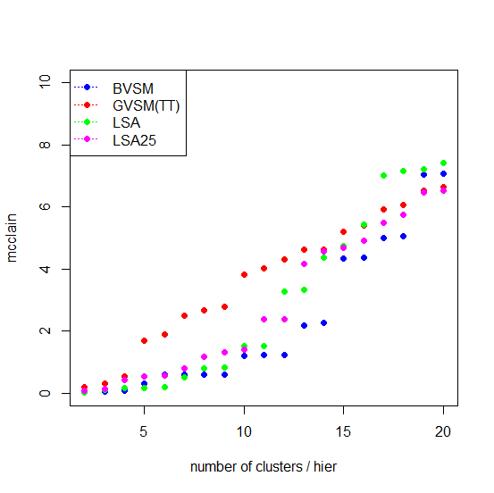

* Is the quotient of the mean within-cluster and between-cluster distance.
* The range is [0,+∞).
* To be minimized.

## Ratkowsky_Lance
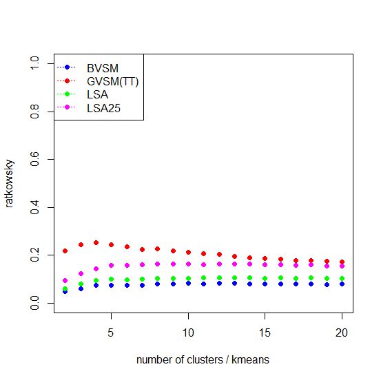
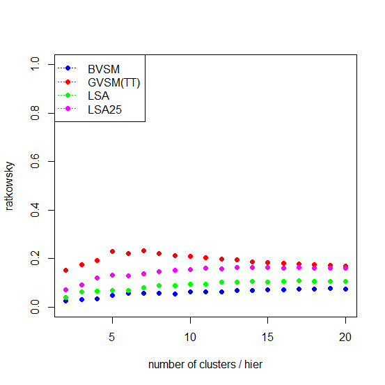

* Is based on the mean of the quotients between between-group dispersion and TSS for each variable of the data.
* The range is [0,+∞).
* To be maximized.

## Davies-Bouldin
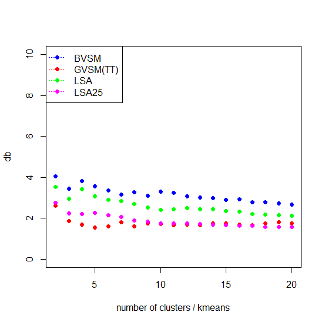
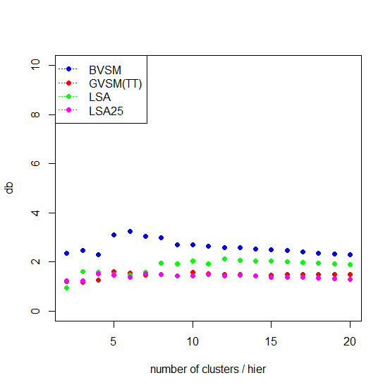

* Deals with those clusters which are “close” in terms of their barycenters to each other but have very distant points within.
* The range is [0,+∞).
* To be minimized.

## Silhouette
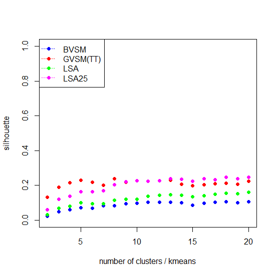
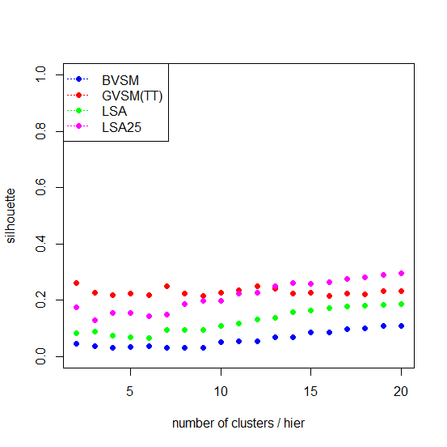

* Operates with quantities that only depend on the average distances between a given observation and other observations inside 
its own and also inside the nearest cluster.
* The range is [0,1].
* To be maximized.

## Dunn
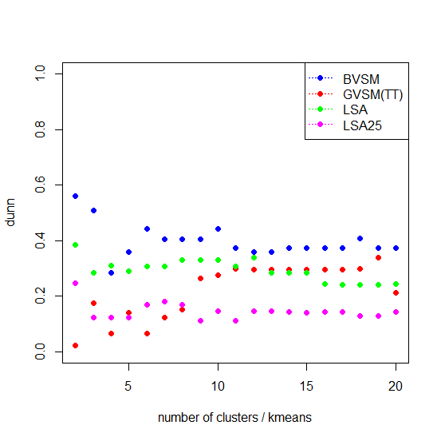
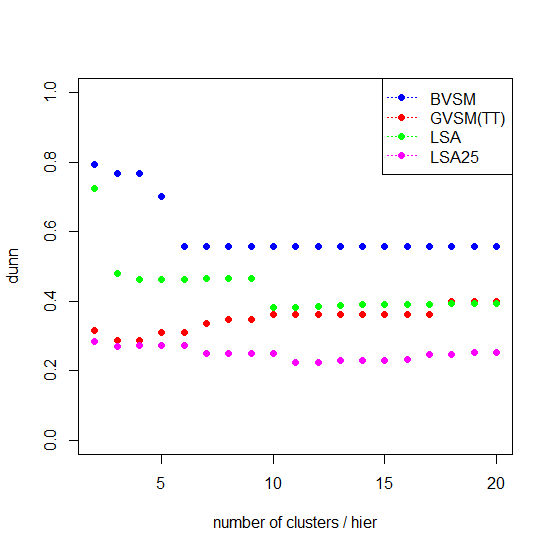

* Deals with those clusters which contain the closest points belonging to different clusters and also with clusters that have very distant points within.
* The range is [0,+∞).
* To be maximized.
